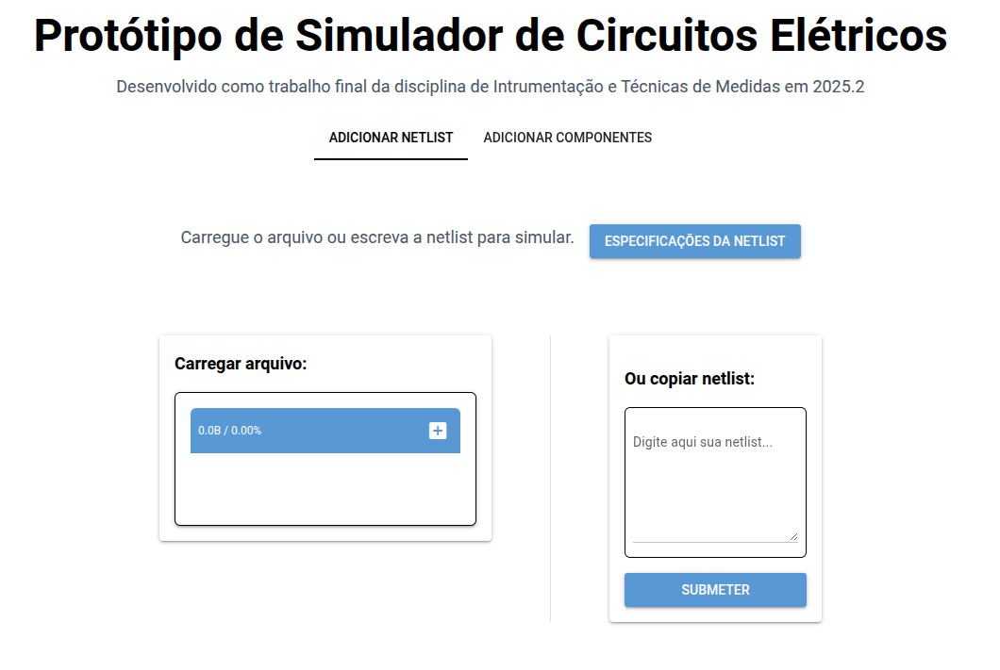
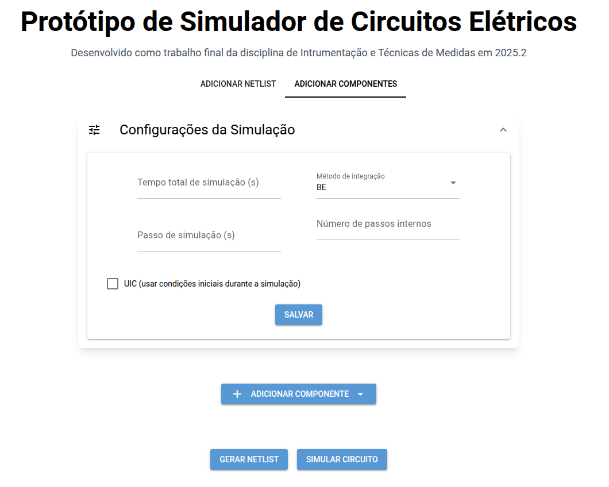

# Documentação

Implementação do segundo trabalho da disciplina de Instrumentação e Técnicas de Medidas - EEL710,
do ano de 2025, segundo período, sob a supervisãoo técnica de João Victor da Fonseca Pinto, professor do DEL/UFRJ.

## 🔎 Visão Geral do Projeto

O projeto consiste no desenvolvimento de um software de protótipo para simular circuitos elétricos, fornecendo uma interface intuitiva e ferramentas robustas.

Requisitos e especificações técnicas: [Trabalho 2](assets/Trabalho%202.pdf)

## 🧱 Estrutura do Código

A arquitetura do sistema foi organizada em módulos para facilitar manutenção, expansão e compreensão. Abaixo está a descrição dos principais componentes:

```text
/src
 ├── controller/
 │    └── simulador.py
 ├── model/
 │    ├── simulacao.py
 │    ├── circuito.py
 │    └── elementos/
 │          ├── base.py
 │          ├── resistor.py
 │          ├── capacitor.py
 │          ├── indutor.py
 │          └── ...
 ├── view/
 │    ├── components
 │    │     └── header.py
 │    ├── pages
 │    │     ├── abas.py
 │    │     ├── paginaAddComponente.py
 │    │     └── páginaAddNetlist.py
 │    └──especsNetlist.txt
 └── tests/
      ├── netlists
      │     ├── chua.net
      │     ├── netlist1.txt
      │     └── ...
      ├── resultados
      │     ├── chua.sim
      │     ├── resultado1.txt
      │     └── ...
      └──especsNetlist.txt
```

### **Descrição dos módulos**

- controller/ — Funções para receber as interações do usuário, processar a lógica de negócios, interagir com os modelos e retornar uma resposta.

- model/ — Contém toda a lógica do domínio, como simulação, montagem de matrizes, classes dos elementos, etc.

- view/ — Interface gráfica (NiceGUI).

- tests/ — Suítes de testes funcionais.

## 🔧 Instalação e Configuração

### 1. Pré-requisitos

- Python 3.14.0

- Pip

- Dependências listadas em requirements.txt

### 2. Instalação

```bash
 git clone https://github.com/larissabral/itmTrabalho2.git
cd projeto
pip install -r requirements.txt
```

### 3. Execução

No diretório raiz do projeto:

```bash
python main.py
```

## ▶️ Uso

### Via interface gráfica

Acesse [Protótipo Simulador](https://itmtrabalho2-production.up.railway.app/) (ou [localhost](http://localhost:8080/) se estiver rodando localmente)

- #### Simular por netlist (arquivo ou texto)



- #### Adicionar componentes para gerar netlist ou simular



## 🧪 Testes

Os testes estão localizados no diretório tests/.

### Executando os testes

```bash
pytest -q
```

## 🧩 Diagrama de Classes


Esse diagrama demonstra:

- **Herança** entre elementos e ElementoBase

- **Encapsulamento** com atributos internos

- **Responsabilidades** centradas (cada classe faz apenas o que deve fazer)
